# Linux 操作系统编程笔记

[toc]

- 系统调用和C库函数并不是一一对应，可能几个不同的函数会调用到同一个系统调用。
- 并非所有的库函数都会调用系统调用，例如：`printf`函数会调用`write`系统调用以输出，但是`strcpy、atio`函数则不会使用任何系统调用。

## 帮助文档

```shell
help cd
mkdir --help
man ls
```


## 目录命令

```shell
ls 
-a #all 所有文件含隐藏文件
-l #long 长格式显示，详细信息
-t #time 按修改时间排序
```

## 浏览文件

```shell
cat 
-E #show ends 每行结束显示$
-n #number 显示行号
```

## 文件操作

```shell
cp
-i #interactive 交互式,重写文件之前，提示用户确认
-r #recursive 递归的，递归复制目录及内容，复制目录使用
-u #update 仅复制目标目录中不存在的文件，差量式备份
-v #verbose 详实的，显示详实的信息

rm #支持正则表达式 *
-i
-r
```

## Linux 管道

```shell
命令1 | 命令2
#命令1的正确输出作为命令2的操作对象

多命令执行符号
命令1；命令2 #顺序执行，无任何逻辑关系
逻辑与和或
命令1 && 命令2 
命令1 || 命令2 
```

## 分页查看

```shell
more和less作用差不多，但是more不支持上一页操作，据说新版本支持，但是本地测试不行ubuntu 18.04

ps -aux | less#PgUp和PgDn,或者f和b
```


## 查找文件

```shell
find #在当前目录及其子目录下查找,直接搜索硬盘,速度慢
-name xxx #搜索名字为xxx

find /etc -name "*.log" #在/etc目录下查找
---

locate == find -name 
# locate 搜索数据库，但是数据不及时，，依赖于数据库的更新，一般一天更新一次

---

whereis # 只能用于程序名的搜索，whereis grep

---

grep #匹配字符，支持正则表达式
grep [参数] <要找的字符> <要查找的字串的源文件>
-c #计算查找次数
-i #ignore case 忽略大小写

ps -ef | grep -c svn #查找指定进程
cat test | grep -nf test2 #在test中查找test2出现的地方并且显示出现的行号、
grep 'linux' test1.txt test2.txt #在两个文件中查找linux
cat test | grep ^u #正则表达式，查找以u开头的
```

## 查看杀死进程

```shell
ps process status ,执行ps命令那个时刻的进程快照

ps命令死记硬背
ps -ef #显示所有进程信息，连同命令行
ps -ef | grep ssh #显示指定进程的信息
UID：启动这些进程的用户。
PID：进程的进程ID。
PPID：父进程的进程号（如果该进程是由另一个进程启动的）。
C：进程生命周期中的CPU利用率。
STIME：进程启动时的系统时间。
TTY：进程启动时的终端设备，与终端无关显示？
TIME：运行进程需要的累计CPU时间。
CMD：启动的程序名称。
F：内核分配给进程的系统标记。
S：进程的状态（S代表在休眠；R代表正在运行或在运行队列中等待；Z代表僵化，进程已结束但进程描述符存在，直到父进程调用wait()函数释放；T代表停止，I(idle)空闲）。
PRI：进程的优先级（越大的数字代表越低的优先级）。
NI：谦让度值用来参与决定优先级。
ADDR：进程的内存地址。
SZ：假如进程被换出，所需交换空间的大致大小。
WCHAN：进程休眠的内核函数的地址。

----

ps -aux #列出正在内存中的程序
a-all u-user x-执行execute

USER：该 process 属于那个使用者账号的
PID ：该 process 的号码
%CPU：该 process 使用掉的 CPU 资源百分比
%MEM：该 process 所占用的物理内存百分比
VSZ ：该 process 使用掉的虚拟内存量 (Kbytes)
RSS ：该 process 占用的固定的内存量 (Kbytes)
TTY ：该 process 是在那个终端机上面运作，若与终端机无关，则显示 ?，另外， tty1-tty6 是本机上面的登入者程序，若为 pts/0 等等的，则表示为由网络连接进主机的程序。
STAT：该程序目前的状态，主要的状态有
    R ：该程序目前正在运作，或者是可被运作
    S ：该程序目前正在睡眠当中 (可说是 idle 状态)，但可被某些讯号 (signal) 唤醒。
    T ：该程序目前正在侦测或者是停止了
    Z ：该程序应该已经终止，但是其父程序却无法正常的终止他，造成 zombie (疆尸) 程序的状态
START：该 process 被触发启动的时间
TIME ：该 process 实际使用 CPU 运作的时间
COMMAND：该程序的实际指令
```

这里显示lpd的PID一直在变化为什么呢。这是因为grep 自己产生的查找lpd的进程，也就是说使用grep进程查找的时候，grep都会产生执行这条命令的查找进程。所以每次看到的pid不一样。因为每次执行这个命令都会产生新的 grep lpd进程。

剔除掉grep本身产生的一条输出，在命令后面加上-v grep : `ps -aux | grep lpd | grep -v lpd`

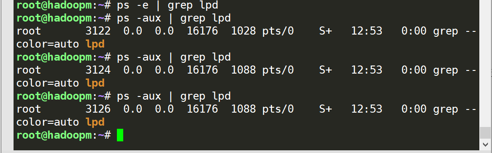

```shell
top 和ps相对，动态显示进程信息


统计信息区：
前五行是当前系统情况整体的统计信息区。下面我们看每一行信息的具体意义。
按下U键，输入用户名，查看指定用户的进程
按下K键，输入PID，删除进程
---
第一行，任务队列信息，同 uptime 命令的执行结果，具体参数说明情况如下：

14:06:23 — 当前系统时间

up 70 days, 16:44 — 系统已经运行了70天16小时44分钟（在这期间系统没有重启过的吆！）

2 users — 当前有2个用户登录系统

load average: 1.15, 1.42, 1.44 — load average后面的三个数分别是1分钟、5分钟、15分钟的负载情况。

load average数据是每隔5秒钟检查一次活跃的进程数，然后按特定算法计算出的数值。如果这个数除以逻辑CPU的数量，结果高于5的时候就表明系统在超负荷运转了。

---
第二行，Tasks — 任务（进程），具体信息说明如下：

系统现在共有206个进程，其中处于运行中的有1个，205个在休眠（sleep），stoped状态的有0个，zombie状态（僵尸）的有0个。

---
第三行，cpu状态信息，具体属性说明如下：

5.9%us — 用户空间占用CPU的百分比。

3.4% sy — 内核空间占用CPU的百分比。

0.0% ni — 改变过优先级的进程占用CPU的百分比

90.4% id — 空闲CPU百分比

0.0% wa — IO等待占用CPU的百分比

0.0% hi — 硬中断（Hardware IRQ）占用CPU的百分比

0.2% si — 软中断（Software Interrupts）占用CPU的百分比

备注：在这里CPU的使用比率和windows概念不同，需要理解linux系统用户空间和内核空间的相关知识！

---
第四行,内存状态，具体信息如下：

32949016k total — 物理内存总量（32GB）

14411180k used — 使用中的内存总量（14GB）

18537836k free — 空闲内存总量（18GB）

169884k buffers — 缓存的内存量 （169M）

---
第五行，swap交换分区信息，具体信息说明如下：

32764556k total — 交换区总量（32GB）

0k used — 使用的交换区总量（0K）

32764556k free — 空闲交换区总量（32GB）

3612636k cached — 缓冲的交换区总量（3.6GB）

备注：

第四行中使用中的内存总量（used）指的是现在系统内核控制的内存数，空闲内存总量（free）是内核还未纳入其管控范围的数量。纳入内核管理的内存不见得都在使用中，还包括过去使用过的现在可以被重复利用的内存，内核并不把这些可被重新使用的内存交还到free中去，因此在linux上free内存会越来越少，但不用为此担心。

如果出于习惯去计算可用内存数，这里有个近似的计算公式：第四行的free + 第四行的buffers + 第五行的cached，按这个公式此台服务器的可用内存：18537836k +169884k +3612636k = 22GB左右。

对于内存监控，在top里我们要时刻监控第五行swap交换分区的used，如果这个数值在不断的变化，说明内核在不断进行内存和swap的数据交换，这是真正的内存不够用了。

---
第六行，空行。

---
第七行以下：各进程（任务）的状态监控，项目列信息说明如下：

PID — 进程id

USER — 进程所有者

PR — 进程优先级

NI — nice值。负值表示高优先级，正值表示低优先级

VIRT — 进程使用的虚拟内存总量，单位kb。VIRT=SWAP+RES

RES — 进程使用的、未被换出的物理内存大小，单位kb。RES=CODE+DATA

SHR — 共享内存大小，单位kb

S — 进程状态。D=不可中断的睡眠状态 R=运行 S=睡眠 T=跟踪/停止 Z=僵尸进程

%CPU — 上次更新到现在的CPU时间占用百分比

%MEM — 进程使用的物理内存百分比

TIME+ — 进程使用的CPU时间总计，单位1/100秒

COMMAND — 进程名称（命令名/命令行）
```

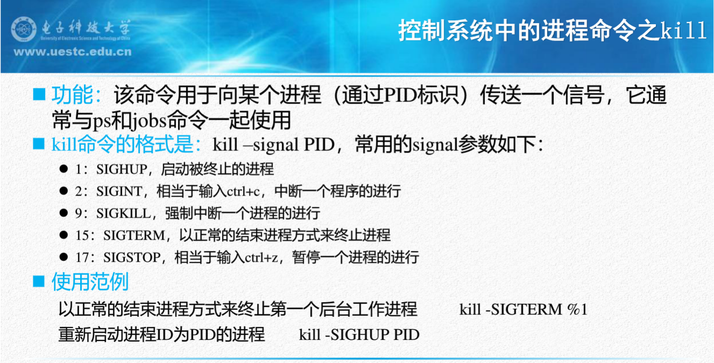

```shell
kill -l #列出所有信号名称

kill PID #默认发送SIGKILL(9)强制杀死进程，可能丢失数据
kill -15 PID #推荐使用终止信号SIGTERM(15)终止进程
查找进程，杀死进程
ps -ef | grep vim
yhsm       4738   4727  0 12:56 pts/0    00:00:00 grep --color=auto vim
kill 4738

---

killall = kill processes by name 直接杀死指定名字的进程
killall -KILL vim
```


## 打包压缩

Linux下只能压缩打好的包

```shell
tar
-c #新建打包create
-t #查看包里的文件
-x  #解包或者解压缩extract
-j  #通过bzip2的支持压缩解压
-z  #通过gzip的支持压缩解压
-v  #显示详实信息visable
-f filename
-C dir

通过gzip压缩解压
tar zcvf FileName.tar.gz
tar zxvf FileName.tar.gz 
```

## 用户权限

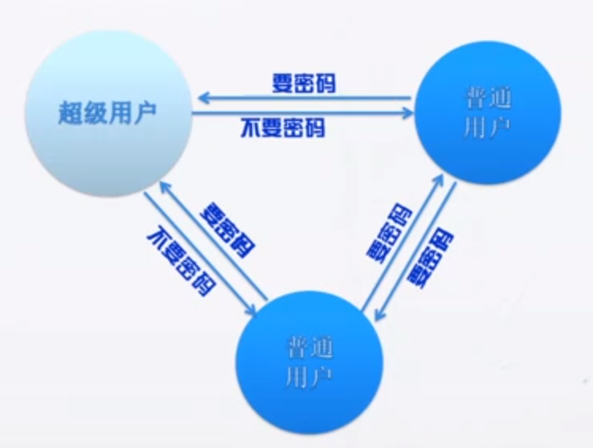

使用`su root `切换到`root`需要输入**`root`的密码**，如果主机是多人共同管理的环境时，使用`su root`切换到root需要让每个人都知道root的密码，容易导致密码的泄露。解决办法是：使用sudo代替su切换到超级管理员权限，使用sudo切换只需要知道**自己的密码**即可，有利于系统的安全性。

```shell
用户uid:每个用户唯一识别号码，超级用户为0，系统用户1-499，普通用户500+

用户至少属于一个用户组，但是可以同时属于多个附加组，权限=用户组权限+附加组权限

su xxx #切换用户

id xxx #显示用户相关信息，不加用户名则显示当前用户
whoami #查看当前用户名
w #查看当前登录系统用户和详细信息

权限：
读取：浏览文件目录内容
写入：对文件的修改，对目录删除添加重命名
执行：对可执行文件的执行，对目录的进入权限

文件用户分类：
文件所有者：建立文件和目录的用户；
文件所有者所在组用户：文件所有者所属用户组中的其他用户；
其他用户：既不是文件所有者，又不是文件所有组所在组的其他所有用户
超级用户：负责整个系统的管理和维护，拥有系统中所有文件的全部访问权限。
```

**新建用户**

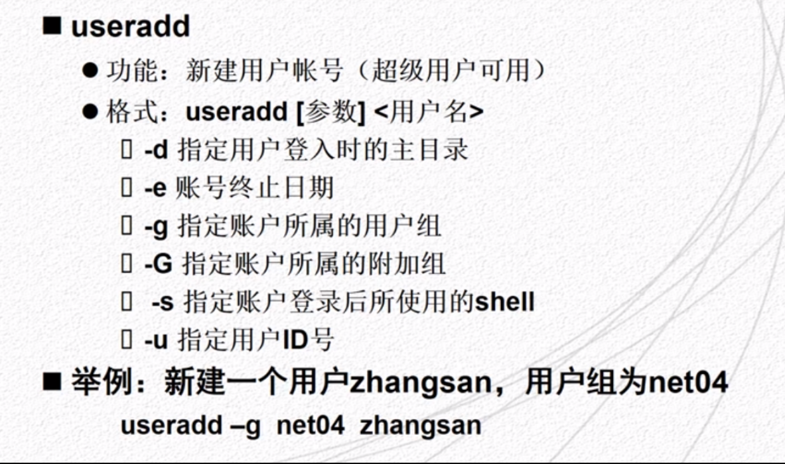

**删除用户**

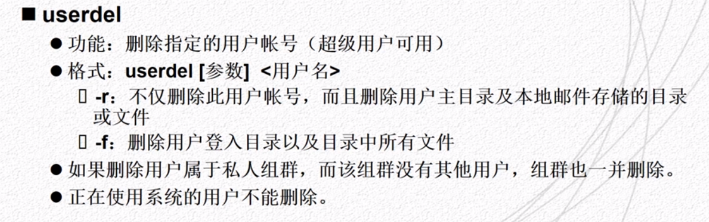

**设置用户密码**

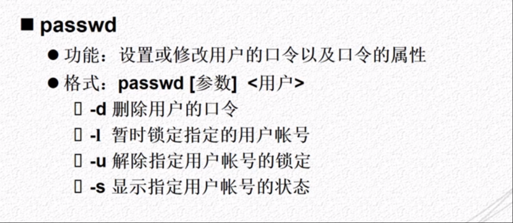

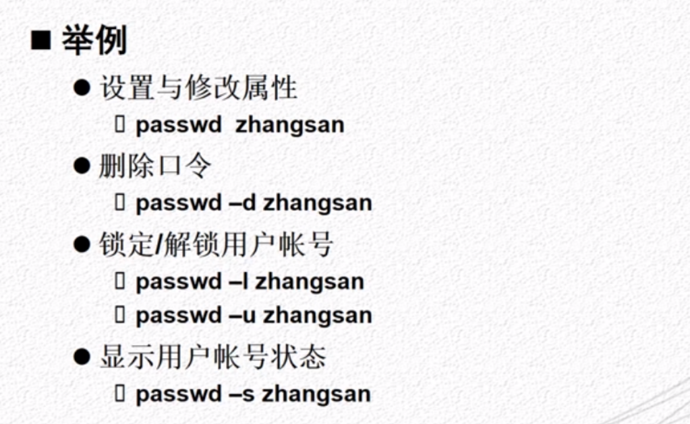

**权限表示法**

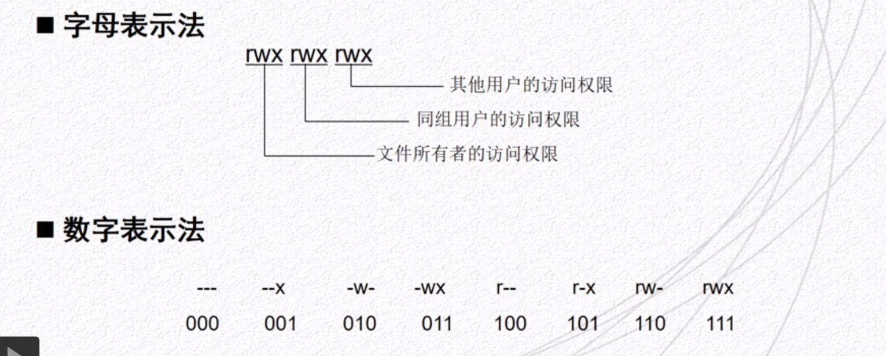


**修改文件权限**

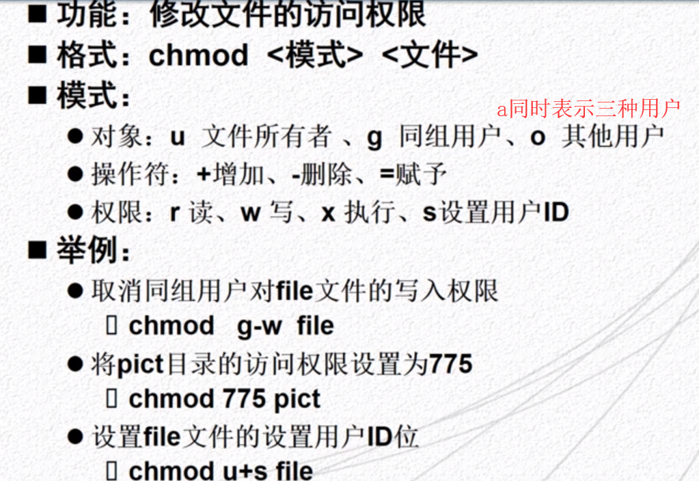


**修改文件所有者和群组**

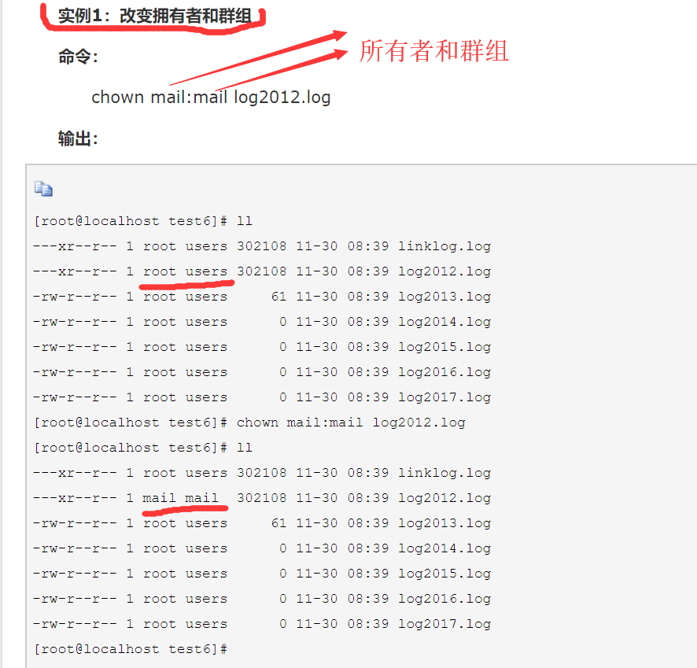


## 程序编译

```shell
g++ a.cpp -o FileName #不加-o默认为a.out
-Wall #输出警告信息
```


## 文件系统

一切皆文件，所有东西设备等都被模拟成了文件，文件操作可以跨文件系统执行（在底层被封装了）

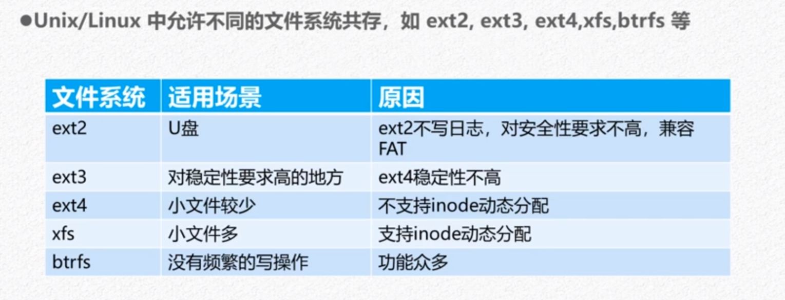


## 文件属性


## Linux-C编程

```shell
int main(int argc,char *argv[]) #在Linux下argc默认存储可执行文件名，argv[1]~...存储命令行参数

1.
./a.out  #输出./a.out
./a.out a b c  #输出./a.out a b c
    
```

### open()打开创建文件

一般用于打开或者创建一个文件，根据参数定制文件属性和权限

**函数定义**

```c
#include <fcntl.h>
#include <sys/stat.h>

int open(const char *pathname, int flags);
int open(const char *pathname, int flags, mode_t mode);
```

**返回值**

操作成功返回文件描述符号，操作失败返回-1.

**参数含义**

1. `pathname`文件的绝对路径名

2. `flags`

   打开文件所采用的的操作，必须制定以下三个常量之一，且只能指定一种

   - `O_RDONLY`：只读模式
   - `O_WRONLY`：只写模式
   - `O_RDWR`：可读可写

   以下常量为可选项，和上面的必选项通过`|`合并作为第二个参数

   - `O_APPEND` 表示追加，如果原来文件里面有内容，则这次写入会写在文件的最末尾。
     `O_CREAT` 表示如果指定文件不存在，则创建这个文件
     `O_EXCL` 表示如果要创建的文件已存在，则出错，同时返回 -1，并且修改 errno 的值。用于**防止创建重名文件**。

3. `mode`

   设置文件权限，只在第二个参数为`O_CREAT`时才有作用，否则可以忽略这个参数。

   ```shell
   S_IRWXU 00700 权限，代表该文件所有者具有可读、可写及可执行的权限。 
   S_IRUSR 或S_IREAD， 00400权限，代表该文件所有者具有可读取的权限。 
   S_IWUSR 或S_IWRITE，00200 权限，代表该文件所有者具有可写入的权限。 
   S_IXUSR 或S_IEXEC， 00100 权限，代表该文件所有者具有可执行的权限。 
   S_IRWXG 00070权限，代表该文件用户组具有可读、可写及可执行的权限。 
   S_IRGRP 00040 权限，代表该文件用户组具有可读的权限。 
   S_IWGRP 00020权限，代表该文件用户组具有可写入的权限。 
   S_IXGRP 00010 权限，代表该文件用户组具有可执行的权限。 
   S_IRWXO 00007权限，代表其他用户具有可读、可写及可执行的权限。 
   S_IROTH 00004 权限，代表其他用户具有可读的权限 
   S_IWOTH 00002权限，代表其他用户具有可写入的权限。 
   S_IXOTH 00001 权限，代表其他用户具有可执行的权限。 
   
   # 00644权限表示-rw-r–r–，对应Linux下的文件权限
    //S_I RWXU
    //R read
    //W write
    //X execute
    //U user 文件所有者
    //G group 文件所有者所在组
    //O other 其他用户
   ```

### strerror()输出错误信息

```c
#include <errno.h>
printf(strerror(errno)); //strerror将错误信息转化成可读的字符串
```

### Linux-C实现cp命令

```c
/*
./mycp ./solve.c ./tmp/aaa
./mycp ./solve.c ./tmp
*/
#include <stdio.h>
#include <dirent.h>
#include <unistd.h>
#include <sys/types.h>
#include <sys/stat.h>
#include <fcntl.h>
#include <string.h>
#include <stdlib.h>
#include <errno.h>

int main(int argc,char *argv[]){
	
	//通过参数数量判断输入的参数是否异常
    if(argc!=3){
        if(argc<3) puts("参数至少为两个！");
        else puts("参数过多！");
        exit(0);
    }

	//以只读的方式打开源文件，获取源文件句柄
    int sourceFile=open(argv[1],O_RDONLY);
    if(sourceFile<0){
        printf("打开源文件失败");
        //printf(strerror(errno));
        exit(0);
    }


    char const *path=argv[2];
    struct stat s_buf;

    /*获取文件信息，把信息放到s_buf中*/
    stat(path,&s_buf);

	
	//判断第二个参数是否是目录，如果是目录，那么默认是拷贝后的文件与源文件同名，需要给目的地址加上源文件的名字
    if(S_ISDIR(s_buf.st_mode)){
	//printf("%s\n",argv[0]);
	//printf("%s\n",argv[1]);

        int len=strlen(argv[1]);
        --len;
        char c;
		
		//获取源文件的名称
        while ((c=argv[1][len])!='/'){
            len--;
        }
        
		//将源文件的名称加到第二个参数中，这样就将命令转化成了第一种命令
        int len2=strlen(argv[2]);
	argv[2][len2++]='/';

        for(int i=len+1;argv[1][i]!='\0';i++)argv[2][len2++]=argv[1][i];
        argv[2][len2]='\0';

	//printf("%s\n",argv[2]);
    }
	
	//以读写的方式打开目标文件，获取目的文件句柄，如果目标文件不存在，那么创建目标文件
	//权限设置为RWXU
	//R为可读，W为可写，X为可执行
	//U表示文件所有者拥有以上的权限
    int destinationFile=open(argv[2],O_RDWR|O_CREAT|O_EXCL,S_IRWXU);

    if(destinationFile<0){
        puts("文件已存在！,输入Y/y覆盖文件");
        //printf(strerror(errno));
        char input;
        input=getchar();

		//创建文件时，如果出现同名文件，以交互的方式询问用户是否覆盖源文件
        if(input=='y'||input=='Y'){

            destinationFile==open(argv[2],O_RDWR|O_CREAT,S_IRWXU);

            if(destinationFile<0){
                puts("没有权限");
                //printf(strerror(errno));
                exit(0);
            }

        }

        else exit(0);
    }

    //char buffer[BUFFERSIZE];
    char buffer;
    int readResult,writeResult;
	
	//获取读文件的句柄和写文件的句柄，遍历源文件的所有字符，边读边写入目标文件
    while(readResult=read(sourceFile,&buffer,sizeof(buffer))>0){
		
        writeResult=write(destinationFile,&buffer,sizeof(buffer));

        if(writeResult!=readResult){
            puts("写入文件失败");
            //printf(strerror(errno));
            exit(0);
        }
    }

    if(readResult<0){
        puts("读取源文件失败");
        //printf(strerror(errno));
        exit(0);
    }

    puts("拷贝成功");
	//读写完毕，关闭源文件和目标文件
    close(sourceFile);
    close(destinationFile);
    exit(1);
}
```


## 进程线程

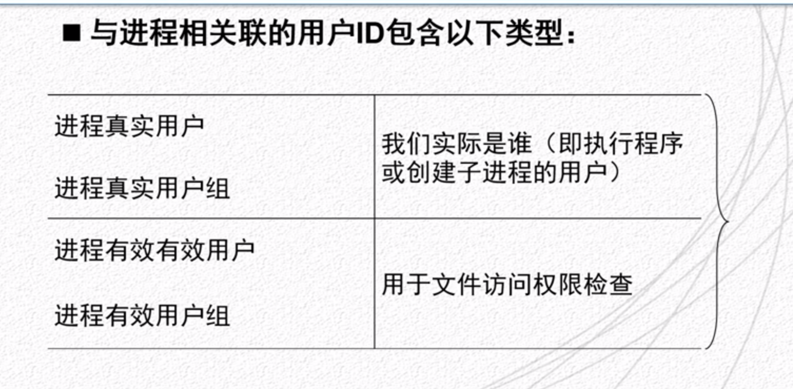


**有的时候进程真实用户，不具有某些特定的权限，需要在执行可执行文件(x权限)的时候，动态修改或者提升权限。**

进程有效用户和有效用户组只有当对可执行文件设置了setuid位或setgid位时才会发生变化。

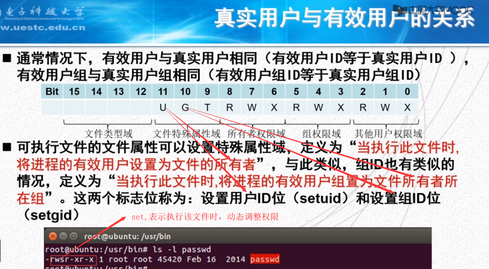


### 进程状态切换

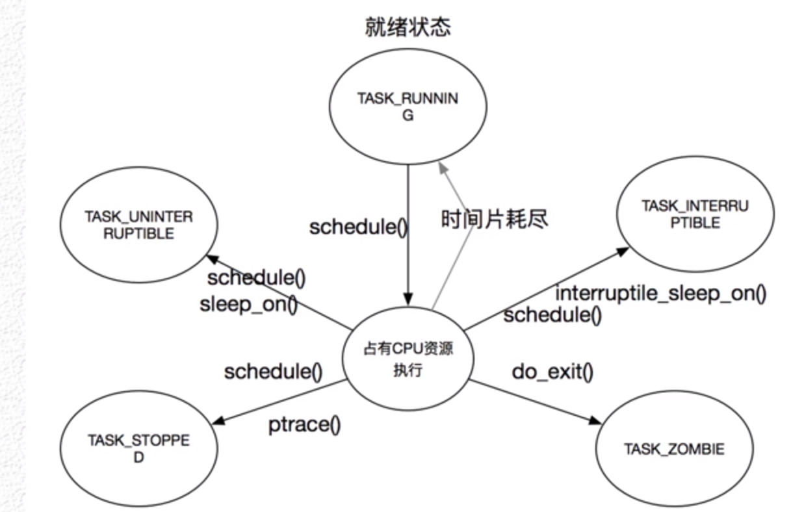


## `exit`和`_exit`详解

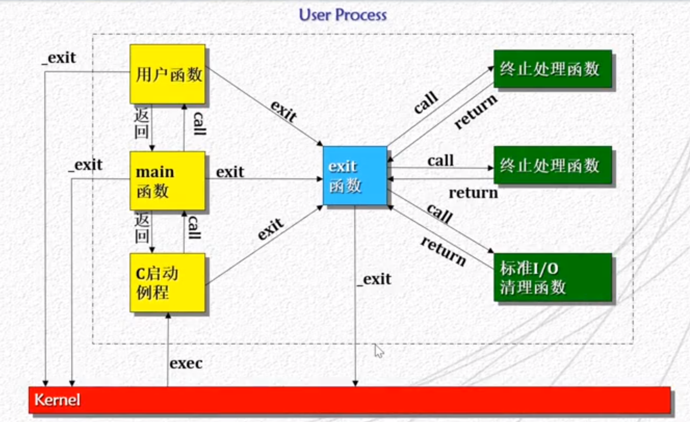


​	


1. **注册终止处理函数**


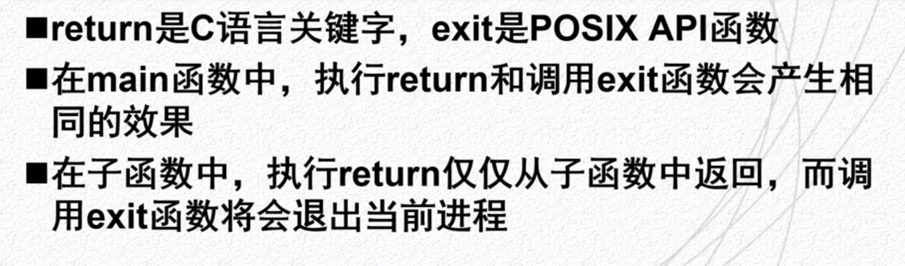

### 特别注意

<font color=red size=5>在`_exit`之前输出换行符，换行符的出现告知系统读出缓冲区数据 </font>

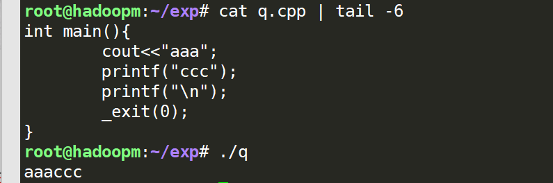


<font color=red size=5>在`_exit`之后输出换行符，在退出之前没有收到读出缓冲区数据的命令，`_exit`没有处理缓冲区直接退回到Linux内核了 </font>

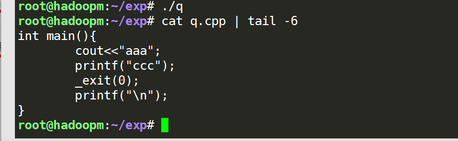


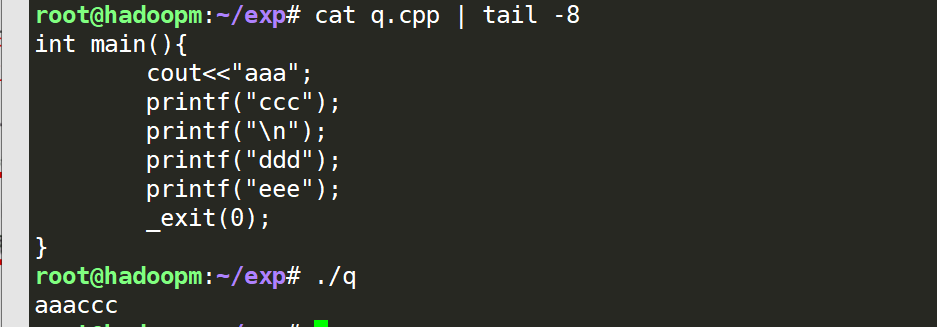


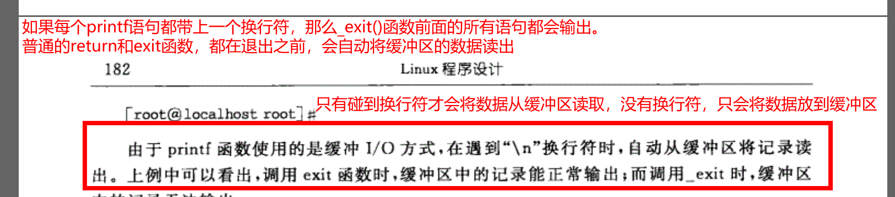


## 创建子进程

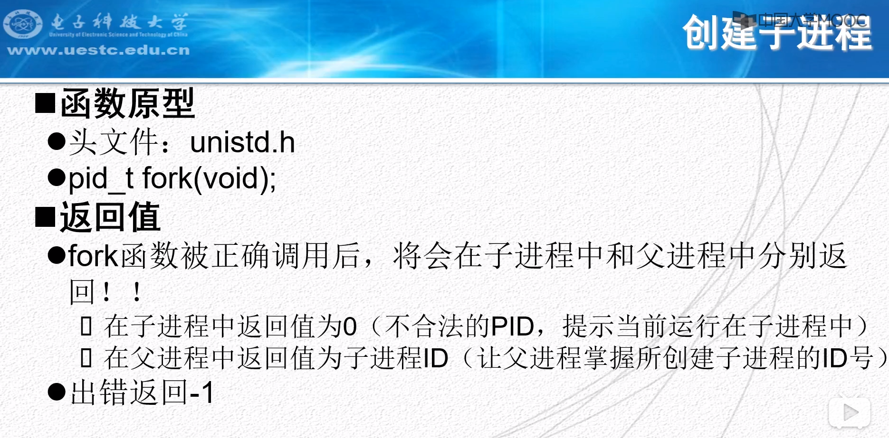

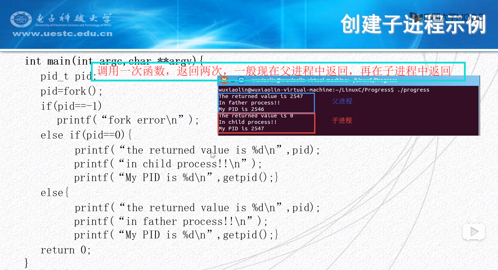

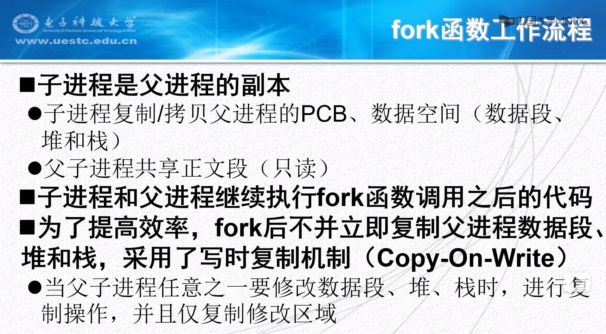


**孩子复制父亲的环境，包括变量的值，但是对变量的修改只影响自己，不影响父亲和孩子**

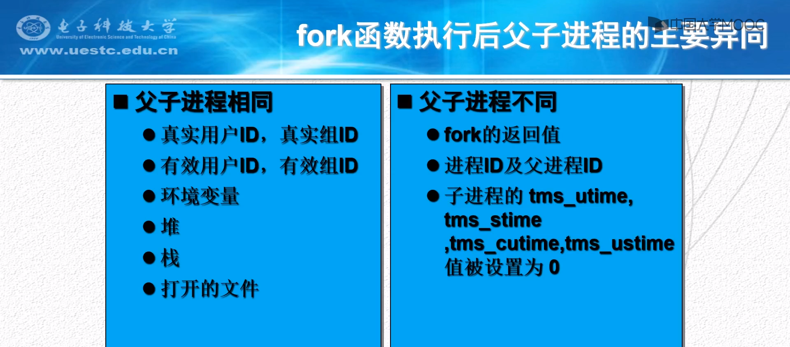


## fork函数详解

fork函数用于创建当前进程的子进程。fork函数调用一次，会返回两次。如果fork成功，子进程返回0，告知子进程自己被创建成功，子进程可以通过`getpid()`和`getppid()`获取自己的进程号和父进程的进程号。父进程返回子进程的pid，告知父进程，该子进程创建成功。

**从调用`fork()`的位置开始，就存在两个进程同时执行程序了，被创建出来的子进程会继续执行下面的C语言程序，至于哪个进程先执行，不确定，需要看操作系统的调度。如果`fork`之后再调用`fork`则父亲和孩子都会执行这个函数，都会创建自己的子进程。**并且子进程的数据都是从父进程那里复制过来的，相当于`fork()`函数创建了一个父进程的副本，但是两个进程对数据的修改不会影响到彼此。就相当于克隆人把自己的头发剪了，不会影响到原来那个人的头发。

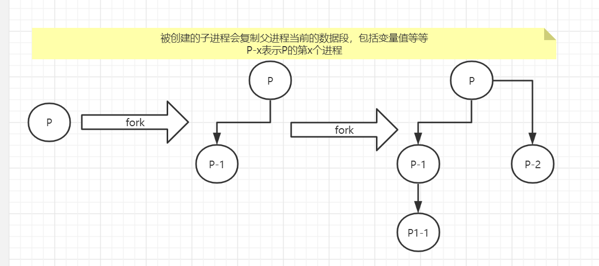

> 由fork创建的新进程被称为子进程（child process）。该函数被调用一次，但返回两次。两次返回的区别是子进程的返回值是0，而父进程的返回值则是新进程（子进程）的进程 id。将子进程id返回给父进程的理由是：因为一个进程的子进程可以多于一个，没有一个函数使一个进程可以获得其所有子进程的进程id。对子进程来说，之所以fork返回0给它，是因为它随时可以调用getpid()来获取自己的pid；也可以调用getppid()来获取父进程的id。(进程id 0总是由交换进程使用，所以一个子进程的进程id不可能为0 )。
>
> fork之后，操作系统共享代码空间，但是数据空间是互相独立的，子进程数据空间中的内容是父进程的完整拷贝，指令指针也完全相同，子进程拥有父进程当前运行到的位置**（两进程的程序计数器pc值相同，也就是说，子进程是从fork返回处开始执行的），但有一点不同，如果fork成功，子进程中fork的返回值是0，父进程中fork的返回值是子进程的进程号，如果fork不成功，父进程会返回错误。
> 可以这样想象，2个进程一直同时运行，而且步调一致，在fork之后，他们分别作不同的工作，也就是分岔了。这也是fork为什么叫fork的原因
>
> 至于那一个最先运行，可能与操作系统（调度算法）有关，而且这个问题在实际应用中并不重要，如果需要父子进程协同，可以通过原语的办法解决。


### fork之后变量地址相同，但是指向不同的值

使用fork函数创建子进程之后，子进程会复制父进程的数据段，但是并非指向相同的内存空间，因此对这些变量的修改并不会在父进程和子进程之间同步。进一步通过%p打印指针变量的地址可以发现，父进程和子进程变量的地址是一样的，那为什么变量的地址一样，却有不同的取值呢？

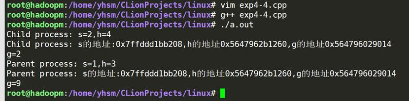

这里涉及到操作系统中地址的相关知识，在操作系统中，地址的表示方式为基址+偏移量（逻辑地址），子进程只是把父进程的逻辑地址复制下来了，但是放在了和父进程不同的基址中，所有子进程和父进程变量的地址（逻辑地址），也就是程序打印出来的地址是一样的，但是其物理地址是不一样的。用户程序看不到真正的物理地址，用户只能得到逻辑地址，也就是使用C语言程序打印出来的是逻辑地址。fork时子进程获得父进程的数据空间、堆和栈的复制，所以逻辑地址也就一起复制过来了。但是每个进程都有自己的物理地址空间，所以即使逻辑地址样，最终计算出来的真实物理地址也可以是不一样的。


## 僵尸进程


## 获知子进程运行状态的改变

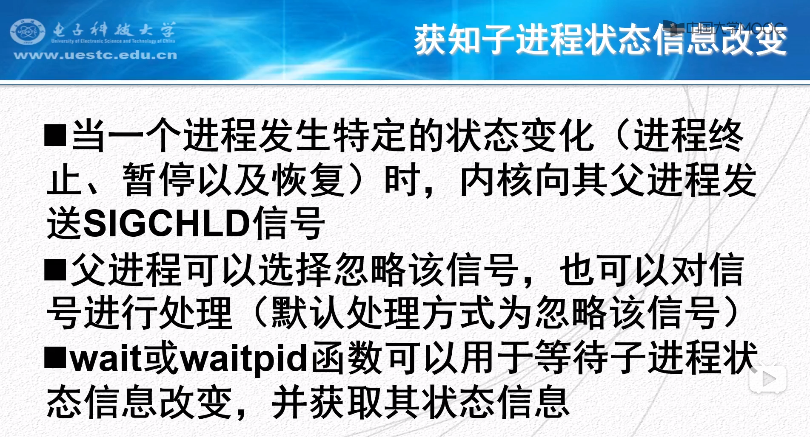

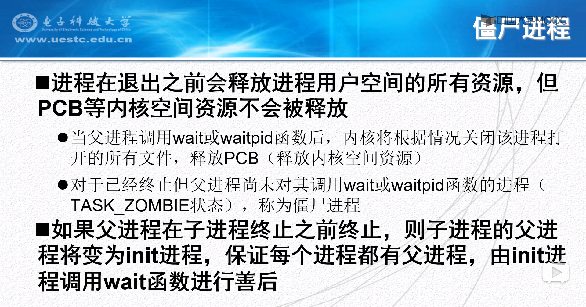

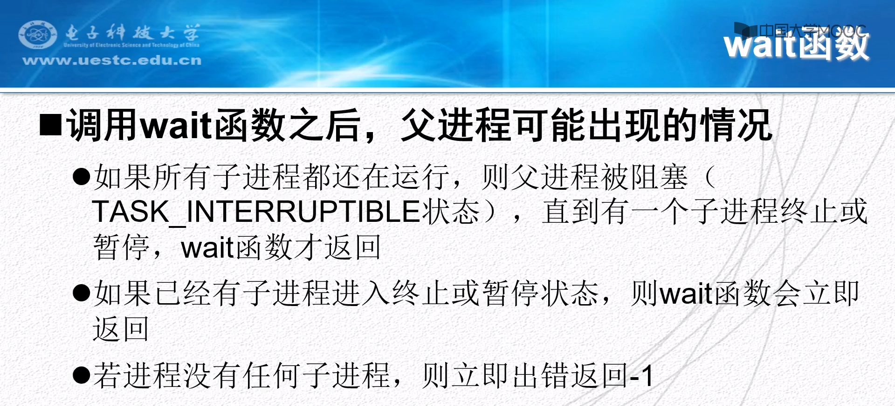

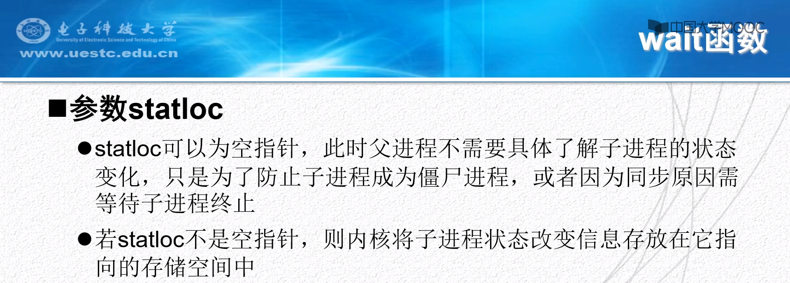

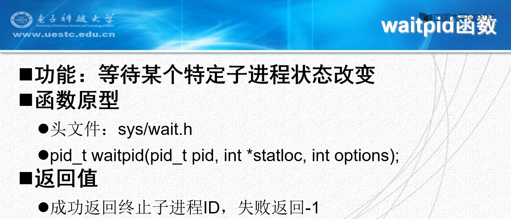

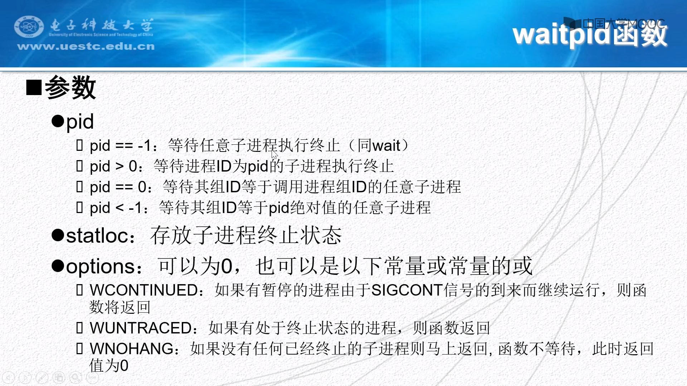


## 进程中执行可执行文件

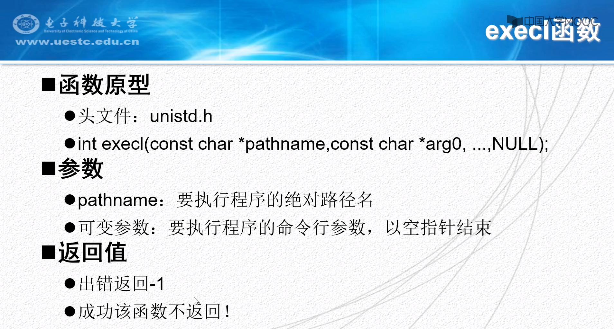

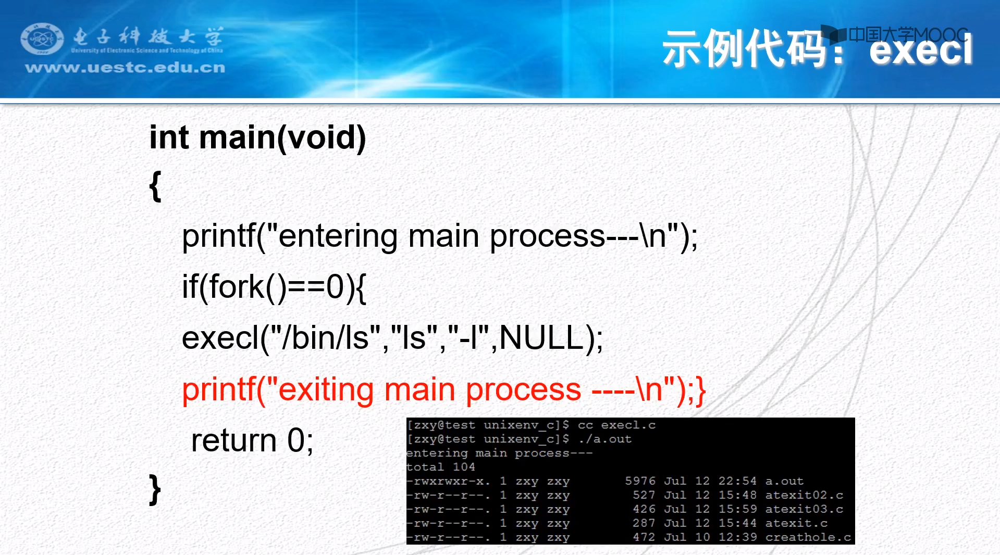


## 线程控制

**进程ID在整个系统中是唯一的，线程ID只在它所属的进程环境中才是唯一的。**

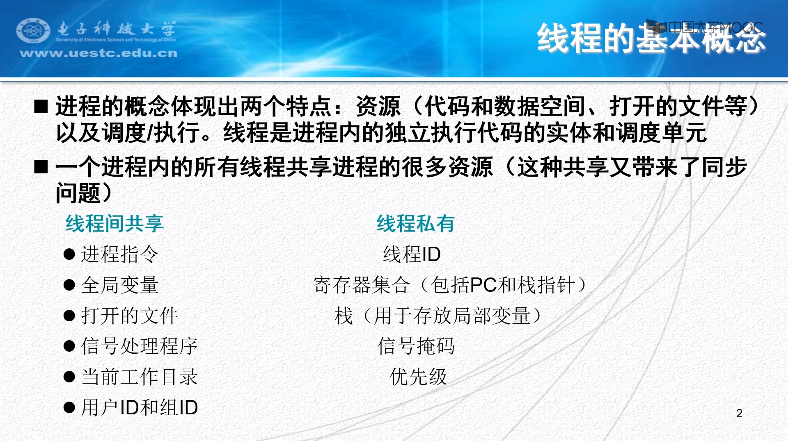

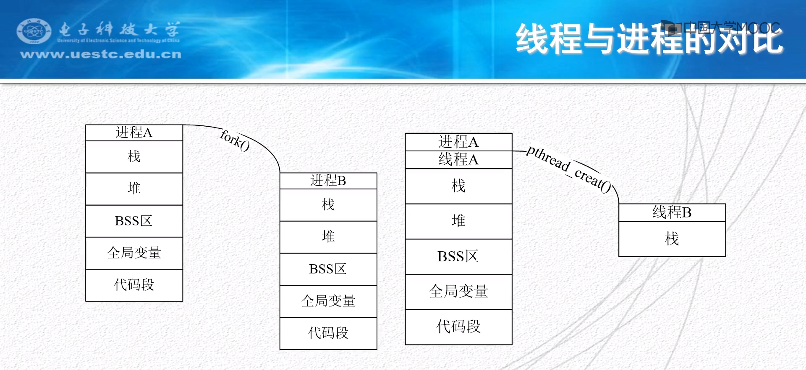

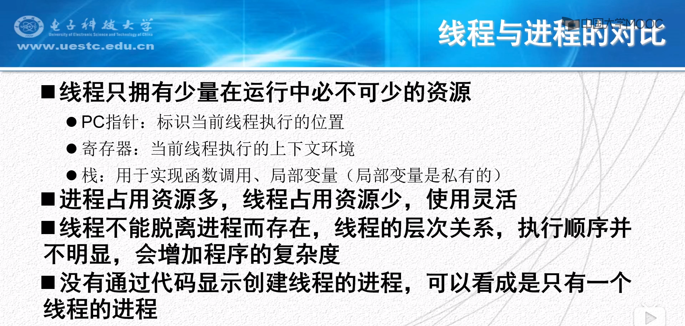

## 多任务

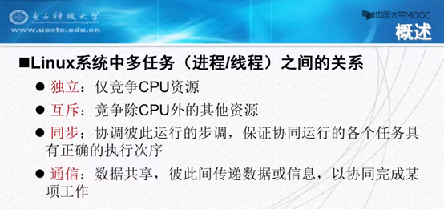

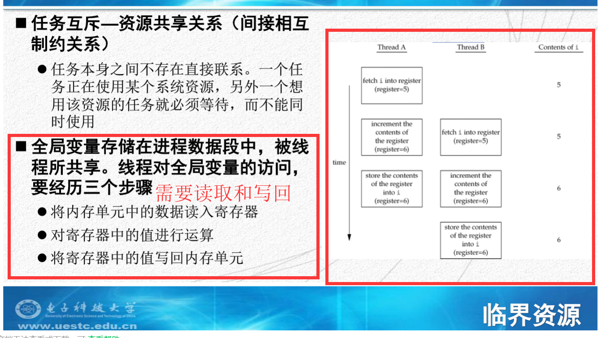


## 进程通信

### ftok函数

[参考博客](https://blog.csdn.net/u013485792/article/details/50764224)

System V提供的IPC机制主要有消息队列、信号量、共享内存三种机制，和文件一样，IPC使用前必须创建，每个IPC结构与一个key值相关联。

key值使用下面函数创建：

` key_t ftok(const char *pathname, int proj_id);`

1. pathname指定的文件名，这个文件必须是存在的而且可以访问的。也可以是特殊文件（例如目录文件），也可以是当前目录`“ . ”`，通设置此参数为当前目录，当前目录一般都存在，且不会被立即删除。

2. id是子序号，它是一个8bit的整数。即范围是0~255。当函数执行成功，则会返回key_t键值，否则返回-1。在一般的UNIX中，通常是将文件的索引节点取出，然后在前面加上子序号就得到key_t的值。

1. pathname是目录还是文件的具体路径，是否可以随便设置

   >可以是文件也可以是目录，ftok根据路径名，提取文件信息，再根据这些文件信息及project ID合成key，该路径可以随便设置。

2. pathname指定的目录或文件的权限是否有要求

   > 该路径是必须存在的，ftok只是根据文件inode在系统内的唯一性来取一个数值，和文件的权限无关

3. proj_id是否可以随便设定，有什么限制条件

   >proj_id是可以根据自己的约定，随意设置。这个数字,有的称之为project ID; 在UNIX系统上,它的取值是1到255;

函数的返回值就是key，它与指定的文件的索引节点号和子序列号id有关。这样就会给我们**一个误解**，即只要文件的路径，名称和子序列号不变，那么得到的key值永远就不会变。

  **确保key值不变，要么确保ftok()的文件不被删除，要么不用ftok()，指定一个固定的key值。**

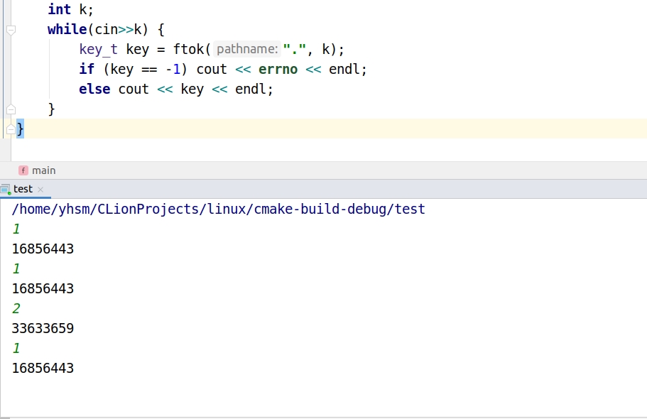

>   事实上，这种认识是错误的，想想一下，假如存在这样一种情况：在访问同一共享内存的多个进程先后调用ftok()时间段中，如果fname指向的文件或者目录被删除而且又重新创建，那么文件系统会赋予这个同名文件新的i节点信息，于是这些进程调用的ftok()都能正常返回，但键值key却不一定相同了。由此可能造成的后果是，原本这些进程意图访问一个相同的共享内存对象，然而由于它们各自得到的键值不同，实际上进程指向的共享内存不再一致；如果这些共享内存都得到创建，则在整个应用运行的过程中表面上不会报出任何错误，然而通过一个共享内存对象进行数据传输的目 的将无法实现。  
