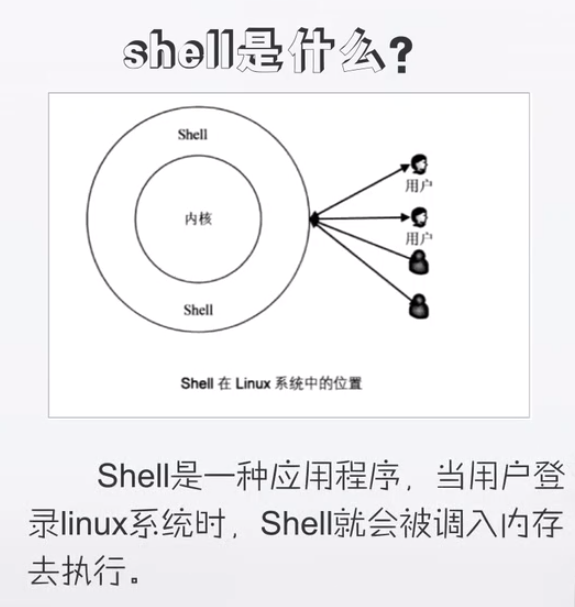
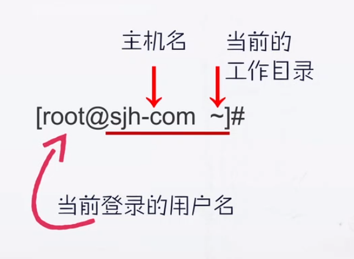
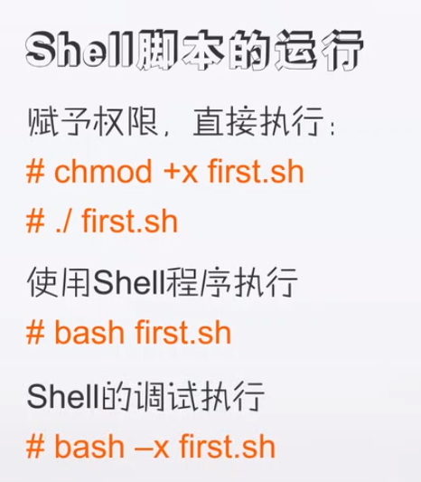
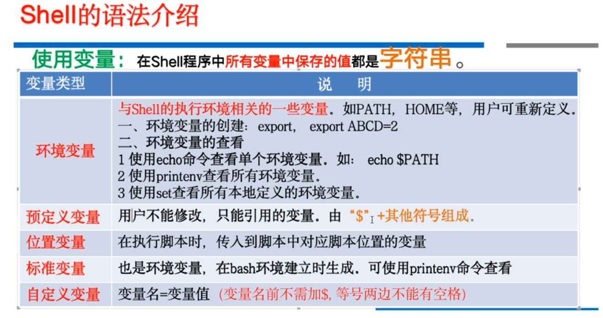
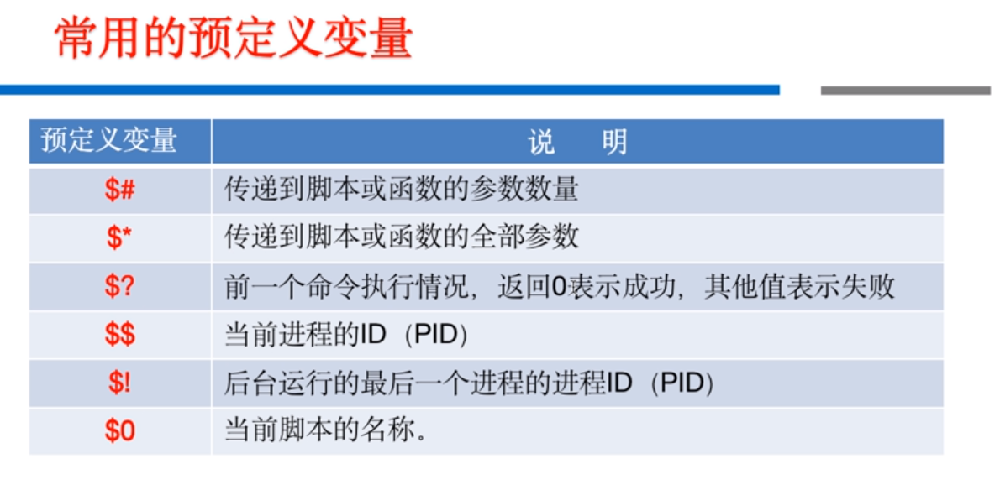
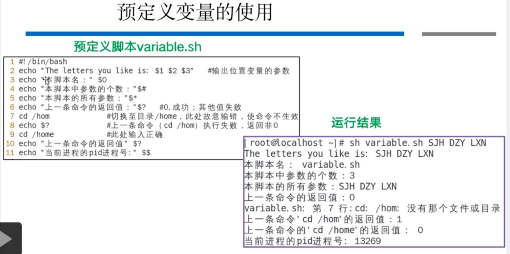
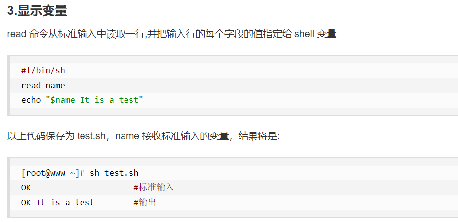
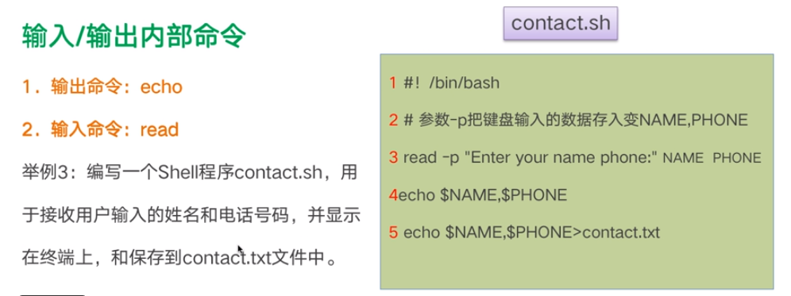
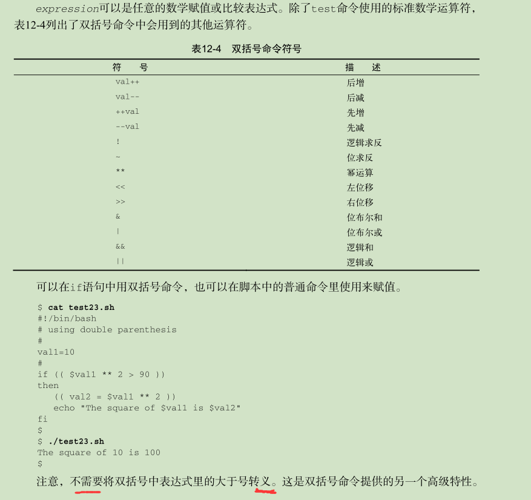
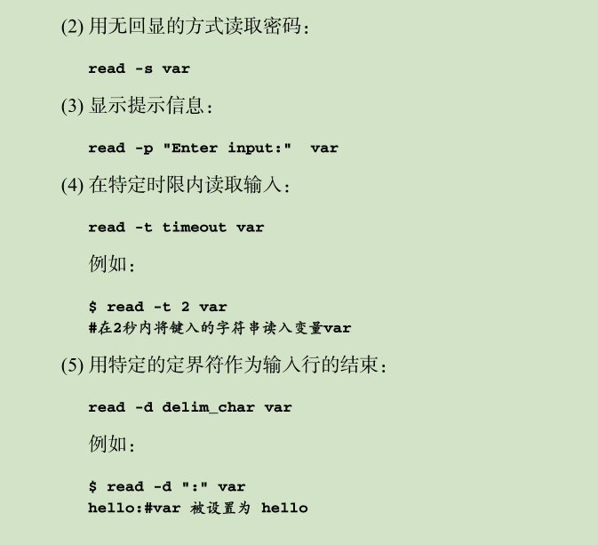

# Shell编程笔记

[toc]

Shell是介于使用者和操作系统核心程序（Kernel）间的一个接口；在Linux中就是命令行。



Bash是Bourne Again Shell的缩写，包括了早期的Bourne Shell 和Korn Shell的所有功能，并且加入了C Shell的某些功能。现在所有操作系统默认的Shell都是Bash。

使用Shell的方法：	

1. 终端窗口
2. 虚拟终端（Ctrl+Alt+F2/F6进入，Ctrl+Alt+F1退出)

`hostname`命令输出主机名，`whoami`输出当前用户名。




**Shell脚本的编译运行**

使用Shell程序执行时，常用`sh firsh.sh    sh -x first.sh`




**Shell变量**












echo:`-n`表示输出不自动换行，`-e`表示开启转义，echo \`xxx\`表示输出xxx命令执行结果

`expr` 命令行计算器 

```shell
echo -e `expr 2 \* 2` #-e开启转义，不加expr不能直接算2*2的结果
```


---


## 调试

- `sh -n xxx.sh` 不执行脚本，只检查脚本是否有语法问题（如：是否拼写错误等等）
- `sh -x xxx.sh` 依次显示每条指令源码和执行结果

- 只进行部分调试

  ```shell
  #只对set中间的语句使用sh -x 调试，其他部分正常执行
  echo a
  
  set -x
  echo b
  set +x
  
  echo c
  ```

  

---


## 输入输出

echo:`-n`表示输出不自动换行，`-e`表示开启转义，echo \`xxx\`表示输出xxx命令执行结果

```shell
echo -e "ad\c" #开始转义，-c表示不自动换行
```

```shell
read -p "请输入" a b c #读入a,b,c
```

```shell
printf "%-10s %-8s %-4.2f\n" 郭靖 男 66.1234 

# -10 -8 -4 指定宽度
# %s 字符串 %f浮点数
郭靖     男      66.12
```


## （重）定义和引用变量

```shell
# 定义

name="yhsm" #等号两边不能有空格，切记切记！！！！！！

for file in 'ls /etc' #使用语句给变量赋值

---
#引用

#可以不加花括号，加了帮助解释器识别变量边界，
echo ${name} 
echo ${name}Script #不加{},则变成${nameScrip}无法识别

---
# 重定义
your_name="qinjx"
echo $your_name

your_name="alibaba" #重定义不使用$
echo $your_name

```

## 多行注释

```
sh没有多行注释
可以将注释定义为函数，只要不调用，就达到了多行注释的效果。
note(){
	asdfasdf #可以随便写，错误语句没没关系，函数每调用，解释器会直接忽略
}

或者


:<<!
注释内容...
注释内容...
注释内容...
!
```

## 字符串

```shell
# 定义
str="this is a string"

note(){
	可以使用单引号或者双引号
	
	单引号字符串的限制：
       1.单引号里的任何字符都会原样输出，单引号字符串中的变量是无效的
       2.单引号字串中不能出现单引号（对单引号使用转义符后也不行）
    
    双引号：
    your_name='qinjx'
	str="Hello, I know your are \"$your_name\"! \n"
    1.双引号里可以有变量
    2.双引号里可以出现转义字符
}

---

# 字符串操作
1. 长度：echo ${#str}
2. 提取字串：echo ${str:1:4} #左闭右闭【】,下标从0开始
```

## 函数

### 返回值

```shell
#!/bin/bash
# author:菜鸟教程
# url:www.runoob.com
funWithReturn(){
    echo "这个函数会对输入的两个数字进行相加运算..."
    echo "输入第一个数字: "
    read aNum
    echo "输入第二个数字: "
    read anotherNum
    echo "两个数字分别为 $aNum 和 $anotherNum !"
    return $(($aNum+$anotherNum))
}
funWithReturn
echo "输入的两个数字之和为 $? !"

---

输出类似下面：

这个函数会对输入的两个数字进行相加运算...
输入第一个数字: 
1
输入第二个数字: 
2
两个数字分别为 1 和 2 !
输入的两个数字之和为 3 !
    
----
函数返回值在调用该函数后通过 $? 来获得。

注意：所有函数在使用前必须定义。这意味着必须将函数放在脚本开始部分，直至shell解释器首次发现它时，才可以使用。调用函数仅使用其函数名即可。
```

### 参数

```shell
funWithParam(){
    echo "第一个参数为 $1 !"
    echo "第二个参数为 $2 !"
    echo "第十个参数为 $10 !"
    echo "第十个参数为 ${10} !"
    echo "第十一个参数为 ${11} !"
    echo "参数总数有 $# 个!"
    echo "作为一个字符串输出所有参数 $* !"
}
funWithParam 1 2 3 4 5 6 7 8 9 34 73
输出结果：

第一个参数为 1 !
第二个参数为 2 !
第十个参数为 10 !
第十个参数为 34 !
第十一个参数为 73 !
参数总数有 11 个!
作为一个字符串输出所有参数 1 2 3 4 5 6 7 8 9 34 73 !

注意，$10 不能获取第十个参数，获取第十个参数需要${10}。当n>=10时，需要使用${n}来获取参数。
```


## 命令输出赋值给变量[命令替换]

1. 反引号符号\`
2. $()格式

```shell
#将当前时间赋值给test
test=`date`
test=$(date)

#以当前时间为名生成日志文件,内容为/usr/bin的目录列表
today=$(date +%y%m%d)
ls /usr/bin -al > log.$today
```


## 方括号数学运算赋值给变量

其实还可以使用expr，但是在shell中方括号更方便。

shell语法中运算符两边不允许空格，但是数学运算的运算符两边需要空格

```shell
l=1
r=2
sum=$[$l + $r]
echo $sum #3
```

## 浮点运算

shell本身本身只能进行整数运算，需要借助Linux内置的bs浮点运算器，使用命令替换的方式，在shell中实现浮点运算。使用`$()`将命令行运算结果赋值给变量。

bc运算器中，scale设置小数位数。

1. 简单计算，直接使用命令替换

`var=$(echo "scale=4; $a / $b" | bc)`

2. 复杂计算，使用输入输出重定向+命令替换

```shell
# EOF字符串标识重定向给bc命令的数据的起止
var1=10.1
var1=10.2
var1=10.3
var1=10.4

var5=$(bc << EOF
scale = 4
a = ( $var1 * $var2 )
b = ( $var1 + $var2 )
a + b
EOF
)

echo $var5
```


## 条件判断

### if-then-else

不像其他变成语言的if-then语句中if的对象是一个等式，等式求值结果为0或者1。

shell 的if 会运行if后面的那个命令，如果运行成功，则为真。

if只能测试命令命令是否成功执行，而不能测试其他条件。

```shell
# 即时xxx运行失败，也会输出b
if xxx
then
	echo "a"
fi 
echo "b"
```


### test或方括号[]测试

test命令的使用可以使if测试其他条件是否成立，而不像传统if命令仅仅只能测试命令是否成功执行。

还可以比较字符串的大小，但是大于小于号需要使用转义，不然会识别成重定向符号

但是数值的比较需要使用 -eq ， -ge等等不方便，建议使用下面的双括号，==方括号内部前后要加空格==

```shell
#测试a是否为空串
a="asfd"
#if test a #使用test也行
if [ a ] #方括号内部前后要加空格
then 
	echo "a"
else
	echo "b"
```


### 数值判断使用双括号




## 获取用户输入

